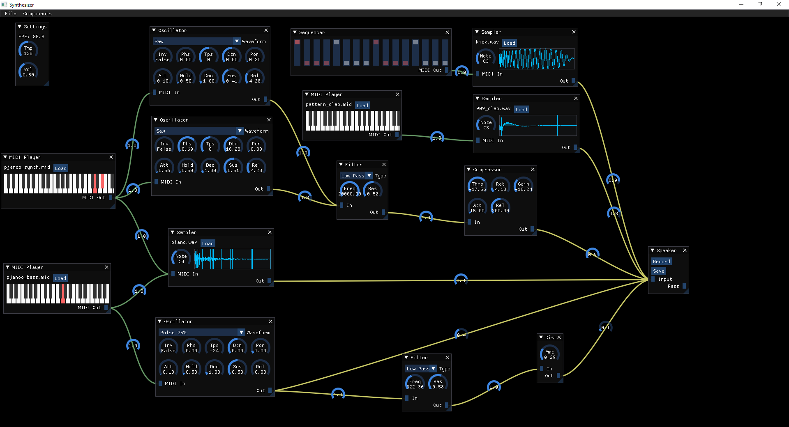
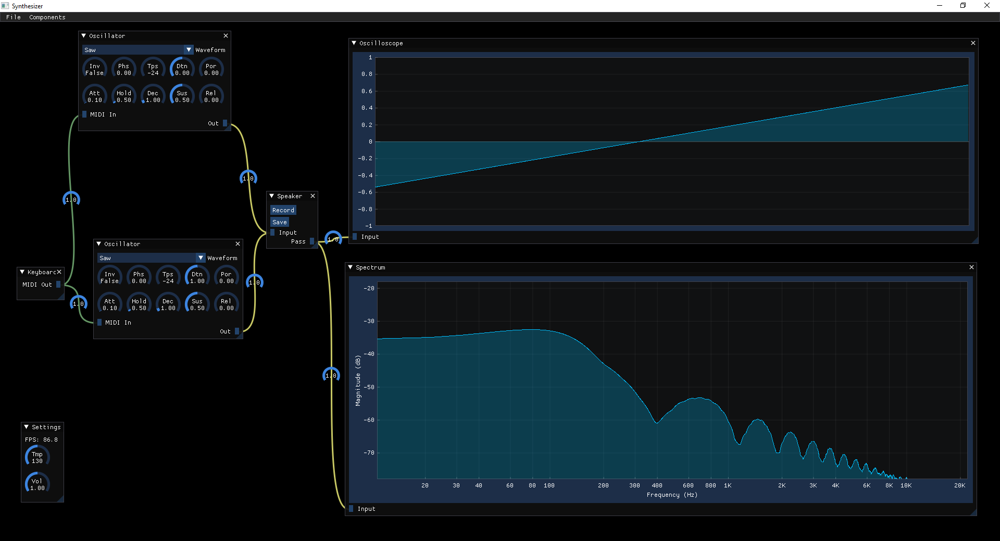
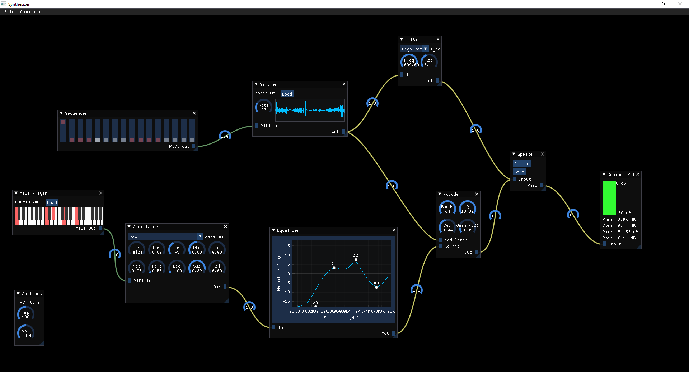

# Synthesizer

Modular Synthesizer with MIDI support.

## Features
- Node based editor
- MIDI
  - Load MIDI files
  - Input from MIDI keyboards
  - Sequencer
- Synthesis
  - Subtractive
  - Additive
  - FM
- Sampler
- Effects
  - VA Filter
  - Delay
  - Flanger
  - Phaser
  - Distortion
  - BitCrusher
  - Equalizer
  - Compressor
  - Vocoder
- Visualization
  - Spectrogram
  - Oscilloscope
  - Decibel Meter
  - Vectorscope
- Save/load projects

## Screenshots

## Libraries

- [SDL2](https://github.com/libsdl-org/SDL)
- [ImGui](https://github.com/ocornut/imgui)
- [ImPlot](https://github.com/epezent/implot)

All libraries are included in the repository.
